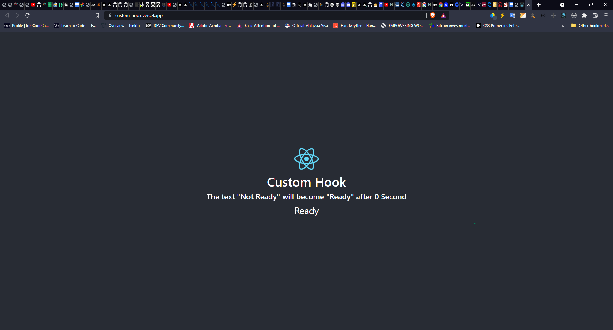

# Custom Hooks with React App

### Demo and Live Link

<a href="https://custom-hook.vercel.app">Custom Hooks </a>

### It's a custom react hook to render the <strong><u>`Not Ready`</u></strong> to <strong><u>`Ready`</u></strong> after 5

### you can clone and run the app:

### `git clone` `npm i` `npm start`

### You can use this hooks to create the more useful custom hooks as per your needs

### Before

### After

